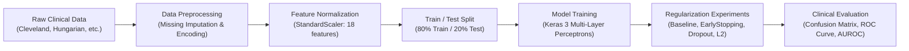

# Multimodal Physiological Risk Modeling

[](https://www.python.org/)
[](https://keras.io/)
[](https://tensorflow.org/)
[](https://pytorch.org/)
[](https://developer.nvidia.com/cuda-toolkit)
[](https://www.nvidia.com/)
[](LICENSE)

A deep learning framework for predictive cardiovascular risk assessment and clinical stratification using multimodal physiological parameters, biomarkers, and diagnostic stress testing features. 

This repository implements an end-to-end machine learning pipeline—from clinical data imputation, categorical encoding, and feature scaling to deep regularized Multi-Layer Perceptrons (MLP), ROC/AUROC evaluation, and cross-platform hardware acceleration (NVIDIA RTX 4050 GPU via CUDA 12.4 on native Windows and WSL2).

---

## Table of Contents
- [Project Overview](#project-overview)
- [Clinical Dataset & Physiological Features](#clinical-dataset--physiological-features)
- [System Architecture & Pipeline](#system-architecture--pipeline)
- [Model Architectures & Regularization](#model-architectures--regularization)
- [Experimental Results & Evaluation](#experimental-results--evaluation)
- [Repository Structure](#repository-structure)
- [Environment Setup & Installation](#environment-setup--installation)
  - [Native Windows Setup (CUDA 12.4 + PyTorch / Keras 3)](#native-windows-setup)
  - [WSL2 Ubuntu Setup (via uv)](#wsl2-ubuntu-setup)
- [Execution & Notebooks Guide](#execution--notebooks-guide)
- [Hardware & GPU Acceleration](#hardware--gpu-acceleration)
- [Future Roadmap](#future-roadmap)
- [License](#license)

---

## Project Overview

Cardiovascular disease (CVD) remains a leading global cause of mortality. Early, non-invasive risk identification enables timely clinical intervention and preventative therapeutics. This project investigates deep neural network architectures for physiological risk modeling using clinical observation metrics.

### Key Objectives:
1. **Multimodal Clinical Feature Engineering**: Integrate demographic, symptomatic, metabolic, and electrocardiographic features into a standardized representation.
2. **Preventing Overfitting in Small-to-Medium Clinical Cohorts**: Implement and rigorously benchmark regularization techniques (EarlyStopping, Dropout, and L2 weight decay).
3. **Clinically Aligned Evaluation**: Prioritize clinical sensitivity (Recall) and discriminative confidence (AUROC) to minimize false negatives (missed high-risk patients) while preserving high diagnostic specificity.
4. **High-Performance Compute Setup**: Configure reproducible execution environments with hardware GPU acceleration on consumer workstations.

---

## Clinical Dataset & Physiological Features

The pipeline trains and evaluates on the comprehensive **UCI Heart Disease** benchmark cohort (Cleveland Clinic Foundation, Hungarian Institute of Cardiology, University Hospital of Zurich, and V.A. Medical Center Long Beach).

### Physiological Modalities & Clinical Indicators

| Modality / Domain | Feature | Description | Clinical Relevance |
| :--- | :--- | :--- | :--- |
| **Demographics** | `age` | Patient age in years | Non-modifiable cardiovascular risk factor |
| | `sex` | Biological sex (1 = male, 0 = female) | Sex-stratified baseline risk differential |
| **Symptomatology** | `cp` | Chest pain type (4 categories) | Typical angina, atypical angina, non-anginal pain, asymptomatic |
| **Vitals & Hemodynamics** | `trestbps` | Resting blood pressure (mm Hg) | Systemic hypertension indicator |
| | `thalach` | Maximum heart rate achieved during exercise | Chronotropic response & physical fitness |
| **Metabolic Biomarkers** | `chol` | Serum cholesterol (mg/dl) | Atherosclerotic lipid profile biomarker |
| | `fbs` | Fasting blood sugar > 120 mg/dl (binary) | Impaired glucose tolerance / metabolic syndrome |
| **Electrocardiography (ECG)** | `restecg` | Resting electrocardiogram results (3 classes) | Normal, ST-T wave abnormalities, left ventricular hypertrophy |
| | `exang` | Exercise-induced angina (binary) | Myocardial ischemia provoked by physical exertion |
| | `oldpeak` | ST depression induced by exercise rel. to rest | Dynamic ischemic stress indicator |
| | `slope` | Slope of peak exercise ST segment (3 classes) | Upsloping, flat, or downsloping ischemic morphology |
| **Advanced Diagnostics** | `ca` | Major vessels (0–3) colored by fluoroscopy | Anatomical stenosis quantification |
| | `thal` | Thallium scintigraphy stress test | Normal, fixed defect, reversible perfusion defect |
| **Target Variable** | `num` | Angiographic coronary artery disease status | Binarized: `0` = No disease (< 50% stenosis), `1` = Disease present (> 50% stenosis) |

### Preprocessing & Hygiene
- **Missing Value Handling**: Replaces missing indicator tokens (`'?'`) with statistical imputations (median for continuous variables, mode for discrete attributes).
- **Categorical Encoding**: Multiclass nominal features (`cp`, `restecg`, `slope`, `thal`) are one-hot encoded using `OneHotEncoder(handle_unknown='ignore')`.
- **Feature Normalization**: Continuous biomarkers are scaled using `StandardScaler` to ensure zero-mean and unit-variance.
- **Data Leakage Prevention**: Preprocessors are fit strictly on the training partition (`X_train`) and applied downstream to the test partition (`X_test`), expanding the raw data into **18 engineered physiological features**.

---

## System Architecture & Pipeline



---

## Model Architectures & Regularization

The predictive backbone consists of a deep Multi-Layer Perceptron (MLP) built with **Keras 3**:

```text
Input (18 physiological features)
  │
  ├── Dense (32 Units, Activation: ReLU)
  │     └── [Optional: Dropout(0.2–0.3) / L2 Kernel Regularizer (0.01)]
  │
  ├── Dense (16 Units, Activation: ReLU)
  │     └── [Optional: Dropout(0.2–0.3) / L2 Kernel Regularizer (0.01)]
  │
  └── Output Layer (1 Unit, Activation: Sigmoid)
        └── Risk Probability P(Disease | Features) ∈ [0, 1]
```

### Regularization Strategies Investigated
1. **Baseline MLP (No Regularization)**: Serves as the control model trained for 100 epochs. Exhibits variance and overfits training data as validation loss increases.
2. **EarlyStopping Optimization**: Monitors `val_loss` with patience, terminating training dynamically and restoring the best recorded weights (`restore_best_weights=True`).
3. **Dropout Regularization**: Introduces stochastic node masking to prevent co-adaptation among correlated biomarkers.
4. **L2 Weight Regularization (Ridge Penalty)**: Adds an $L_2$ norm penalty $\lambda \sum w_i^2$ directly to the dense layer kernels to suppress disproportionate parameter weights.

---

## Experimental Results & Evaluation

All models were evaluated on the held-out test split ($N = 61$).

### Performance Benchmark

| Model Variant | Test Loss | Test Accuracy | Precision | Sensitivity / Recall | F1-Score | AUROC |
| :--- | :---: | :---: | :---: | :---: | :---: | :---: |
| **Baseline MLP** | 0.3910 | 83.61% | 0.8214 | 0.8214 | 0.8214 | 0.8970 |
| **Dropout Regularized MLP** | 0.4056 | **86.89%** | **0.8846** | 0.8214 | 0.8519 | 0.9329 |
| **L2 Regularized MLP** | **0.3919** | **86.89%** | 0.8333 | **0.8929** | **0.8621** | **0.9470** |

### Key Clinical Takeaways:
- **Sensitivity Supremacy with L2 Regularization**: In medical risk modeling, a false negative (failing to identify an individual at risk of a cardiac event) carries severe clinical risk. The **L2 regularized model achieved the highest Sensitivity (89.29%)**, detecting 25 out of 28 positive disease cases in the test set.
- **Exceptional Discriminative Capacity**: The **0.9470 AUROC** of the L2 regularized model indicates robust discrimination across clinical thresholds, making the model well-suited for calibrated probability estimation and risk stratification.

---

## Repository Structure

```text
multimodel-physiological-risk-modeling/
│
├── data/
│   ├── raw/
│   │   ├── heart+disease.zip             # Original UCI compressed archive
│   │   └── heart-disease/                # Raw clinical datasets (Cleveland, Hungarian, etc.)
│   └── processed/
│       ├── X_train.npy                   # Processed training features (18 dimensions)
│       ├── X_test.npy                    # Processed test features (18 dimensions)
│       ├── y_train.npy                   # Training target labels
│       └── y_test.npy                    # Test target labels
│
├── notebooks/
│   ├── 01_keras_fundamentals.ipynb       # Keras tensor fundamentals, activations & loss
│   ├── 02_data_preprocessing.ipynb       # EDA, missing value imputation, encoding & scaling
│   ├── 03_dense_baseline.ipynb           # Model training, regularizers & ROC/AUROC analysis
│   └── best_model.keras                  # Serialized best-performing model checkpoint
│
├── models/                               # Directory for saved model weights and checkpoints
├── results/                              # Evaluation plots, confusion matrices, and ROC curves
├── src/                                  # Modular Python source scripts
│
├── .gitignore                            # Configured to ignore virtualenvs, checkpoints & caches
├── requirements.txt                      # Project dependency specification
├── verify_gpu.py                         # Diagnostic script for GPU, PyTorch & Keras validation
└── README.md                             # Project documentation
```

---

## Environment Setup & Installation

The project supports both **Native Windows** and **WSL2 Ubuntu** environments with **Python 3.11**.

### Native Windows Setup
*(Recommended for direct PyCharm / VS Code development with RTX 4050 GPU)*

1. **Clone the repository:**
   ```powershell
   git clone https://github.com/Prajin-K/Multimodel-physiological-risk-modeling.git
   cd "Multimodel-physiological-risk-modeling"
   ```

2. **Create and activate a Python 3.11 virtual environment:**
   ```powershell
   py -3.11 -m venv .venv
   .\.venv\Scripts\activate
   ```

3. **Install PyTorch with CUDA 12.4 acceleration:**
   ```powershell
   pip install torch torchvision torchaudio --index-url https://download.pytorch.org/whl/cu124
   ```

4. **Install remaining dependencies:**
   ```powershell
   pip install -r requirements.txt
   ```

5. **Verify GPU availability:**
   ```powershell
   python verify_gpu.py
   ```

---

### WSL2 Ubuntu Setup
*(Configured via `uv` for ultra-fast, isolated dependency resolution)*

1. **Open your WSL2 terminal:**
   ```bash
   cd "/mnt/c/Users/prajin/Documents/multimodel physiological risk modeling"
   ```

2. **Install `uv` (if not already installed):**
   ```bash
   curl -LsSf https://astral.sh/uv/install.sh | sh
   source $HOME/.local/bin/env
   ```

3. **Install Python 3.11 & create the virtual environment:**
   ```bash
   uv python install 3.11
   uv venv --python 3.11 .venv-gpu
   source .venv-gpu/bin/activate
   ```

4. **Install requirements:**
   ```bash
   uv pip install -r requirements.txt
   ```

---

## Execution & Notebooks Guide

### 1. Register Jupyter Kernel
To execute notebooks using the dedicated project environment:
```powershell
python -m ipykernel install --user --name multimodel-risk --display-name "Python 3.11 (Risk Modeling)"
```

### 2. Launch JupyterLab
```powershell
jupyter lab
```

### 3. Step-by-Step Notebook Execution
1. **[01_keras_fundamentals.ipynb](notebooks/01_keras_fundamentals.ipynb)**: Foundations of tensor operations, computation graphs, activations, and dense layers in Keras.
2. **[02_data_preprocessing.ipynb](notebooks/02_data_preprocessing.ipynb)**: Raw clinical data ingestion, exploratory data analysis, handling missing values (`'?'`), encoding categorical variables, standard scaling, and exporting `X_train.npy` / `X_test.npy`.
3. **[03_dense_baseline.ipynb](notebooks/03_dense_baseline.ipynb)**: Model training, EarlyStopping callbacks, Dropout and L2 regularization ablation, confusion matrix generation, and ROC/AUROC benchmarking.

---

## Hardware & GPU Acceleration

- **Target Accelerator**: NVIDIA GeForce RTX 4050 Laptop GPU (Ada Lovelace architecture, 6 GB VRAM, sm_89).
- **Backend Architecture with Keras 3**:
  Google discontinued native Windows CUDA support in TensorFlow $\ge 2.11$. **Keras 3** solves this by providing a unified multi-backend engine. By selecting PyTorch as the backend, deep learning workloads execute directly on the RTX 4050 GPU on native Windows:

```python
import os
os.environ["KERAS_BACKEND"] = "torch"
import keras

# Models will compile and train with full CUDA acceleration on the RTX 4050 GPU
```

---

## Future Roadmap

- [ ] **Multimodal Fusion**: Combine tabular EHR data with raw time-series ECG signals using 1D Convolutional Neural Networks (1D-CNN) or BiLSTM networks.
- [ ] **Cross-Validation**: Implement Stratified $K$-Fold cross-validation ($k=5$ or $k=10$) for enhanced statistical robustness.
- [ ] **Explainable AI (XAI)**: Integrate SHAP (SHapley Additive exPlanations) and Integrated Gradients to provide feature attribution scores for clinical decision support.
- [ ] **Calibration & Threshold Tuning**: Optimize classification thresholds using Bayesian decision theory to maximize clinical utility.
- [ ] **REST API Deployment**: Wrap the model in FastAPI for containerized real-time clinical risk scoring.

---

## License

This project is licensed under the MIT License - see the [LICENSE](LICENSE) file for details.
